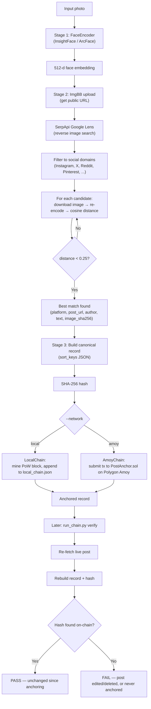
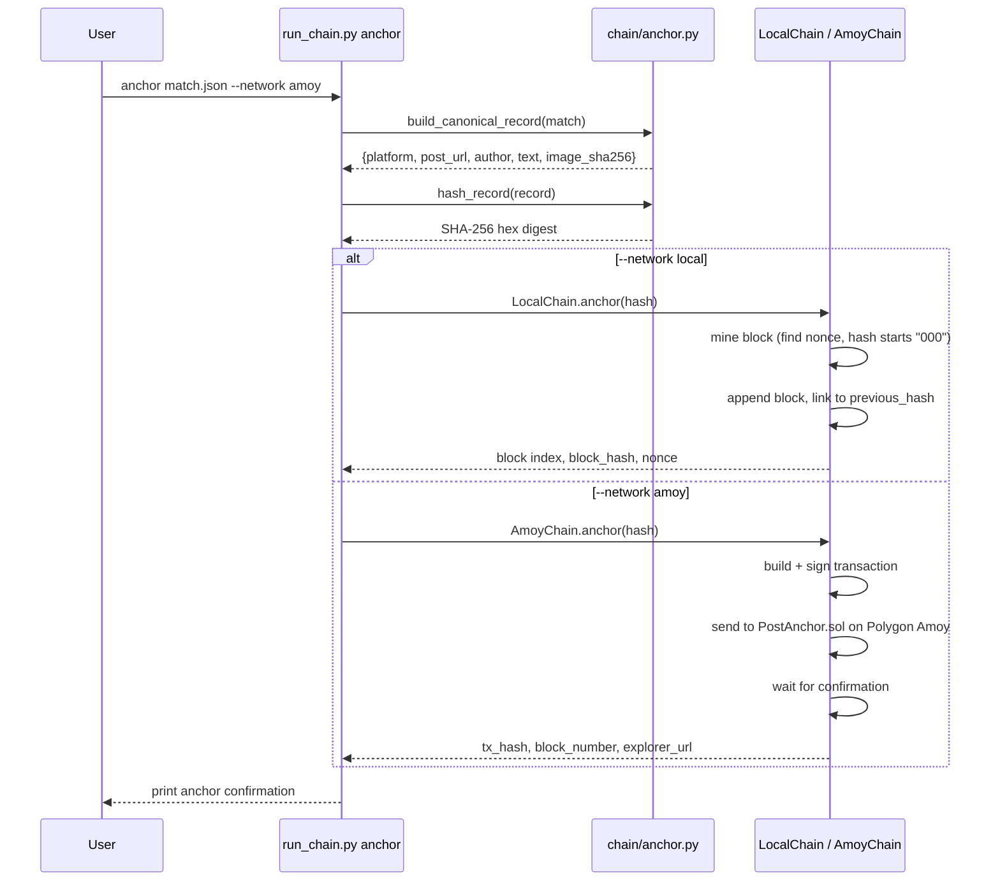
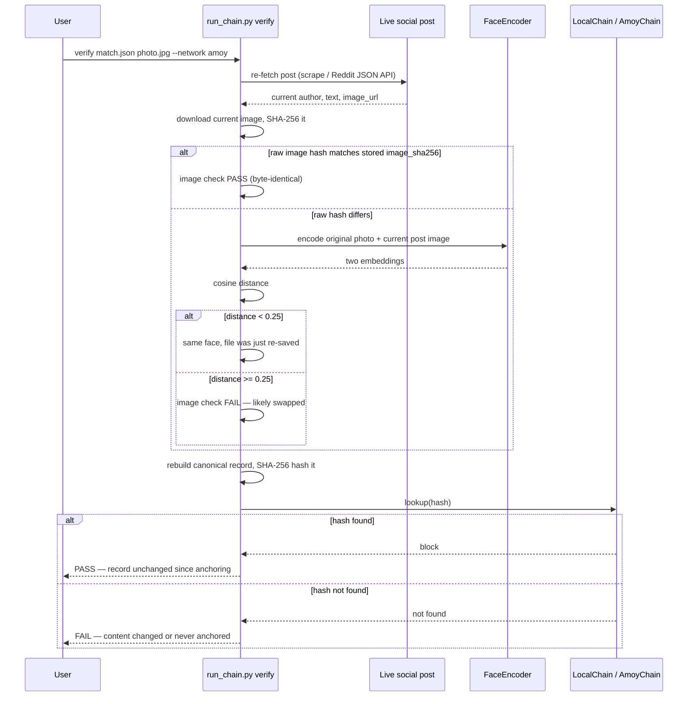
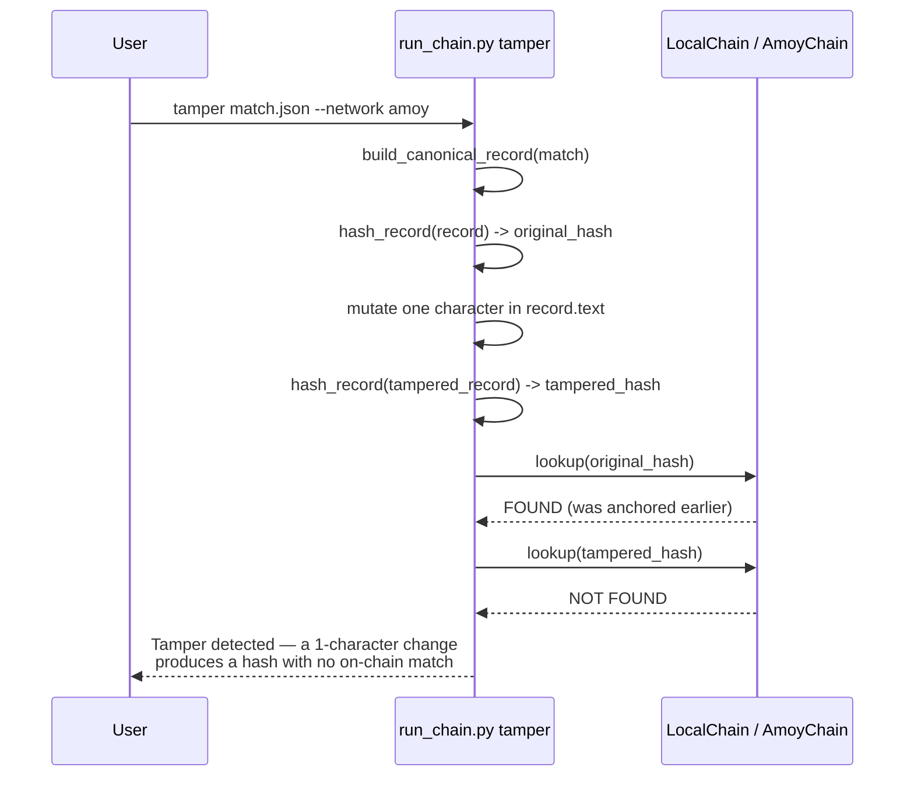

# HH-FaceChain: Face Identification & Blockchain Verification

A pipeline that takes a face photo, finds a real matching social media post on the
web via reverse image search, and anchors that discovery on a blockchain to create
a tamper-evident, re-verifiable record.

Built for **HH Goa 2026 — Task 3: Face Identification & Blockchain Verification**.

---

## What it does

```
Face photo → Face encoding → Reverse image search → Face re-verification
    → Blockchain anchoring → Live re-verification against the chain
```

1. **Detects and encodes** a face from an input photo (InsightFace / ArcFace).
2. **Searches the web** for that face using Google Lens (via SerpApi), filtered to
   known social media platforms (Instagram, X/Twitter, Reddit, Pinterest, Facebook,
   LinkedIn).
3. **Re-verifies** each candidate result by re-encoding its image and comparing it
   against the original face using cosine distance — this filters out visually
   similar but face-mismatched results, since Google Lens itself has no concept of
   "same face."
4. **Anchors** the confirmed match's metadata (platform, post URL, author, text,
   image hash) on a blockchain, as a SHA-256 fingerprint of the canonical record.
5. **Verifies** the record later by re-fetching the live post and confirming its
   fingerprint still matches what's on-chain — and can **demonstrate tamper
   detection** by showing that even a one-character edit produces a hash that no
   longer matches.

---

## Architecture



---

## Project structure

```
hh-facechain/
├── run_search.py           # Stage 1 + 2 end-to-end runner
├── run_chain.py             # Stage 3 CLI: anchor / verify / tamper
├── .env                      # your secrets (never commit this)
├── .env.example               # template for required env vars
├── config/
|   └──config.py
├── faceid/
│   ├── __init__.py
│   └── encoder.py            # FaceEncoder: detect + embed a face
├── search/
│   ├── __init__.py
│   ├── imgbb_client.py       # upload image, get public URL
│   ├── lens_client.py        # SerpApi Google Lens + social-domain filter
│   ├── post_extractor.py     # scrape post metadata (OpenGraph, Reddit JSON API)
│   └── matcher.py            # re-verify candidates against the original face
├── chain/
│   ├── __init__.py
│   ├── anchor.py              # canonical record + SHA-256 hashing
│   ├── local_chain.py         # local simulated PoW blockchain
│   ├── web3_client.py         # Polygon Amoy client (real testnet)
│   └── PostAnchor.sol          # deployed smart contract source
├── match.json                 # saved output of the last Stage 2 run
└── data/
    └── local_chain.json        # local chain storage (auto-created)
```

---

## Setup

### 1. Install dependencies

```bash
pip install insightface onnxruntime opencv-python-headless numpy
pip install requests beautifulsoup4 python-dotenv
pip install web3
```

### 2. Get API keys / accounts

| Service | Used for | Get it at |
|---|---|---|
| ImgBB | Hosting the input photo publicly (needed by SerpApi) | imgbb.com/api |
| SerpApi | Google Lens reverse image search | serpapi.com |
| MetaMask + Polygon Amoy | On-chain anchoring (optional — local chain works without this) | metamask.io, faucet: faucet.polygon.technology |
| Alchemy (or similar) | RPC endpoint for talking to Polygon Amoy | alchemy.com |

### 3. Configure `.env`

Copy `.env.example` to `.env` and fill in:

```
IMGBB_KEY=your_imgbb_api_key
SERPAPI_KEY=your_serpapi_api_key

POLYGON_AMOY_RPC_URL=https://polygon-amoy.g.alchemy.com/v2/YOUR_KEY
WALLET_PRIVATE_KEY=0xyour_testnet_wallet_private_key
POST_ANCHOR_CONTRACT_ADDRESS=0xyour_deployed_contract_address
```

`WALLET_PRIVATE_KEY` should belong to a **testnet-only wallet with no real funds**.
The Amoy variables are only required if you use `--network amoy`; the local chain
needs none of them.

### 4. (Optional) Deploy your own PostAnchor contract

`chain/PostAnchor.sol` is a ~15-line contract that stores a hash on-chain and lets
you look it up. Deploy it yourself via [Remix](https://remix.ethereum.org):
paste the file in, compile, connect MetaMask (set to Polygon Amoy), and deploy.
Copy the resulting contract address into `.env`.

---

## Running it

### Stage 1 + 2: find a match

```bash
python run_search.py path/to/photo.jpg
```

This prints the best match found (if any) and saves it to `match.json`.

### Stage 3: anchor, verify, tamper-test

```bash
# Anchor the match found above
python run_chain.py anchor match.json --network local
python run_chain.py anchor match.json --network amoy

# Re-verify it later against the live post
python run_chain.py verify match.json path/to/photo.jpg --network local
python run_chain.py verify match.json path/to/photo.jpg --network amoy

# Demonstrate tamper-evidence
python run_chain.py tamper match.json --network local
python run_chain.py tamper match.json --network amoy
```

`--network` defaults to `local` if omitted.

---

## Stage 3 in detail: anchor / verify / tamper

Three separate diagrams, one per `run_chain.py` command, since each does a
genuinely different job.

### `anchor` — creating the on-chain record



### `verify` — checking the record still holds



### `tamper` — demonstrating why the hash matters



---

## Which blockchain(s) were used

Both, by design — controlled by `--network`:

- **`local`** — a from-scratch proof-of-work chain in `chain/local_chain.py`,
  persisted to `data/local_chain.json`. Blocks are linked via `previous_hash`,
  and mining requires finding a nonce producing a hash with 3 leading zero hex
  digits. Zero cost, zero setup, works fully offline.
- **`amoy`** — the real, public **Polygon Amoy testnet** (chain ID `80002`).
  `chain/web3_client.py` signs and submits transactions to a deployed
  `PostAnchor.sol` contract (see `chain/PostAnchor.sol`). Anchoring costs a
  small amount of free testnet POL (obtained from a faucet); verification is a
  free read-only call.

The local chain satisfies the task's "local/simulated chain is acceptable"
allowance on its own. Amoy support was added as a stronger demonstration,
since it provides genuine tamper-evidence backed by a real, independently-run
public network rather than a single local file.

---

## Known limitations

- **Local chain is not truly decentralized.** It's a single JSON file on one
  machine — whoever controls that file could, in principle, hand-edit it and
  re-mine subsequent blocks to hide the change. `validate_chain()` can detect an
  *inconsistent* edit, but cannot prevent a determined attacker with full file
  access from rewriting history convincingly. Amoy mode does not share this
  weakness, since it relies on Polygon's independent validator network.
- **Social media scraping is inherently fragile.** Instagram and (to a lesser
  extent) other platforms serve bot-blocked or login-walled pages to
  unauthenticated scrapers, so `post_extractor.py` sometimes cannot retrieve
  `author`/`text`/`image_url` from the page itself. To work around this,
  candidate re-verification uses SerpApi's own matched-image URL as a
  reliable fallback, and Reddit specifically uses its public JSON API
  (`<post_url>.json`) rather than HTML scraping. `author`/`text` may still be
  `null` for platforms where scraping fails and SerpApi doesn't supply them.
- **Face-match threshold (0.25 cosine distance) is a heuristic**, not a
  guarantee. It was chosen based on informal testing and the convention used
  in comparable open-source projects; borderline cases (low-quality photos,
  extreme angles) may be misclassified in either direction.
- **`image_sha256` is a raw byte-level hash**, so a harmless re-encoding of the
  same photo (e.g. re-compression) will register as "changed" during `verify`
  even though the face is unaffected. The face-embedding fallback check exists
  specifically to distinguish "harmless re-save" from "image actually swapped."
- **No authentication/rate-limit handling** for SerpApi/ImgBB beyond what their
  free tiers provide; heavy repeated use will hit quota limits.
- **This tool is intended for verifying provenance of consenting or public
  figures**, not for surveillance or non-consensual tracking of private
  individuals. Reverse face search carries real privacy implications; use
  responsibly and in line with applicable law.

---

## Tech stack summary

| Component | Technology |
|---|---|
| Face detection & embedding | InsightFace (`buffalo_l`, ArcFace) |
| Reverse image search | SerpApi — Google Lens engine |
| Image hosting | ImgBB |
| Post metadata scraping | BeautifulSoup + Reddit JSON API |
| Local blockchain | Custom Python proof-of-work chain |
| Public blockchain | Polygon Amoy testnet (chain ID 80002) |
| Smart contract | Solidity `^0.8.19`, deployed via Remix |
| On-chain interaction | web3.py |
